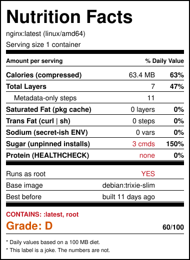
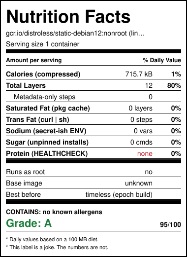
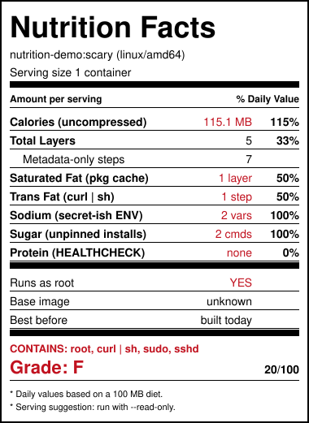

# docker-nutrition-facts

An FDA-style Nutrition Facts label for any container image. The label is a joke. The numbers are not.

<p align="center">
  
  
  
</p>

It reads only the image manifest and config, so it answers in a couple of seconds even for a 5 GB image. It never downloads layers from a registry and never reads env var values.

## Install

```sh
brew install khimananda/tap/docker-nutrition
```

```sh
go install github.com/khimananda/docker-nutrition-facts/cmd/docker-nutrition@latest
```

Or grab a binary from the [releases page](https://github.com/khimananda/docker-nutrition-facts/releases).

### As a Docker CLI plugin

So that `docker nutrition IMAGE` works:

```sh
mkdir -p ~/.docker/cli-plugins
ln -sf "$(command -v docker-nutrition)" ~/.docker/cli-plugins/docker-nutrition
```

There is also an [install script](scripts/install-plugin.sh). It is a `curl | sh` script, which this tool would dock you for, so read it first.

## Usage

```sh
docker nutrition nginx:latest                          # any registry image, no pull needed
docker nutrition ghcr.io/org/app:1.2.3 --platform linux/arm64
docker nutrition myapp:dev --local                     # an image you just built
docker nutrition node:22 --format svg -o label.svg     # for your README
docker nutrition "$IMAGE" --fail-below C               # exit 2 in CI when the grade is D or F
```

```
┌────────────────────────────────────────────────┐
│ Nutrition Facts                                │
│ nginx:latest  (linux/amd64)                    │
│ Serving size 1 container                       │
│ ━━━━━━━━━━━━━━━━━━━━━━━━━━━━━━━━━━━━━━━━━━━━━━ │
│ Amount per serving               % Daily Value │
│ ────────────────────────────────────────────── │
│ Calories (compressed)            63.4 MB   63% │
│ Total Layers                           7   47% │
│   Metadata-only steps                 11       │
│ Saturated Fat (pkg cache)       0 layers    0% │
│ Trans Fat (curl | sh)            0 steps    0% │
│ Sodium (secret-ish ENV)           0 vars    0% │
│ Sugar (unpinned installs)         3 cmds  150% │
│ Protein (HEALTHCHECK)               none    0% │
│ ━━━━━━━━━━━━━━━━━━━━━━━━━━━━━━━━━━━━━━━━━━━━━━ │
│ Runs as root                         YES       │
│ Base image            debian:trixie-slim       │
│ Best before            built 11 days ago       │
│ ━━━━━━━━━━━━━━━━━━━━━━━━━━━━━━━━━━━━━━━━━━━━━━ │
│ CONTAINS: :latest, root                        │
│ Grade: D                                60/100 │
│ ────────────────────────────────────────────── │
│ * Daily values based on a 100 MB diet.         │
│ * This label is a joke. The numbers are not.   │
└────────────────────────────────────────────────┘
```

| Flag | Default | Meaning |
|------|---------|---------|
| `--platform` | `linux/amd64` | Which variant of a multi-arch image to read |
| `--local` | off | Read from the local Docker daemon via `docker save` |
| `-f, --format` | `text` | `text`, `plain`, `json`, `markdown` or `svg` |
| `-o, --output` | stdout | Write to a file |
| `--fail-below` | none | Exit with code 2 when the grade is worse than this letter |
| `--no-color` | off | No colors. `NO_COLOR` is honoured too |
| `--insecure` | off | Allow plain HTTP registries |

Private registries work after `docker login`, including ECR, GCR, GHCR and ACR.

## What the label measures

| Line | What it really is |
|------|-------------------|
| Calories | Total compressed layer size. Daily value is a 100 MB diet |
| Total Layers | Filesystem layers. Daily value is 15 |
| Saturated Fat | Build steps that install OS packages and leave the package cache behind |
| Trans Fat | Build steps that pipe a download straight into a shell |
| Sodium | Env var names that look like secrets, such as `DB_PASSWORD` or `API_TOKEN`. Values are never read |
| Sugar | Install commands with at least one unpinned package, for apt, apk, pip and npm |
| Protein | Whether a `HEALTHCHECK` is set |
| Runs as root | The default user is empty, `root` or `0` |
| Base image | The `org.opencontainers.image.base.name` annotation, when the builder wrote one |
| Best before | Age of the image. Reproducible builds dated 1970 are "timeless" |
| Contains | Allergens: `:latest`, root, `curl \| sh`, `sudo`, `sshd` |

The grade starts at 100 and loses points for each finding. Run with `--format markdown` to see exactly which deductions applied.

Heuristics read the build history, so they are only as good as that history. Multi-stage builds only show the final stage, which is usually what you want.

## GitHub Action

Puts the label on every pull request that builds an image, and updates the same comment on each push.

```yaml
name: nutrition
on: pull_request
permissions:
  contents: read
  pull-requests: write
jobs:
  label:
    runs-on: ubuntu-latest
    steps:
      - uses: actions/checkout@v5
      - run: docker build -t app:pr .
      - uses: khimananda/docker-nutrition-facts@v1
        with:
          image: app:pr
          local: true
          fail-below: D   # optional
```

Outputs `grade` and `score` for later steps. The label also goes to the job summary.

## Add a joke

Footnotes live in [internal/phrases/footnotes.txt](internal/phrases/footnotes.txt). One line each, 44 characters max, kind to everyone. See [CONTRIBUTING.md](CONTRIBUTING.md).

## License

MIT
